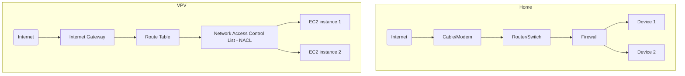

# This is a dummy post



## Text

This a dummy file, with category, tags, an image and and a mermaid graph.

This is some **bold text**, some *italics text* and come **_bold plus italics text_**.

---

## Code

```java
System.out.println("Hello world");
```

## Graphic

This is a mermaid graph.


